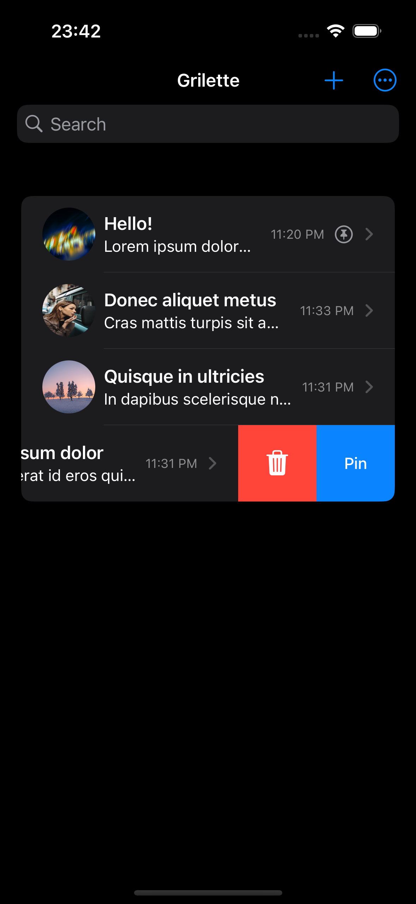
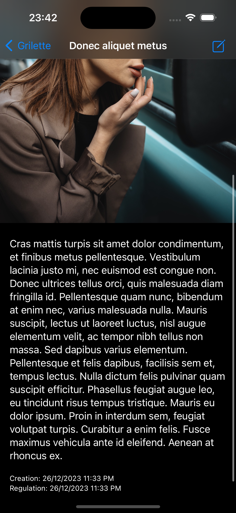
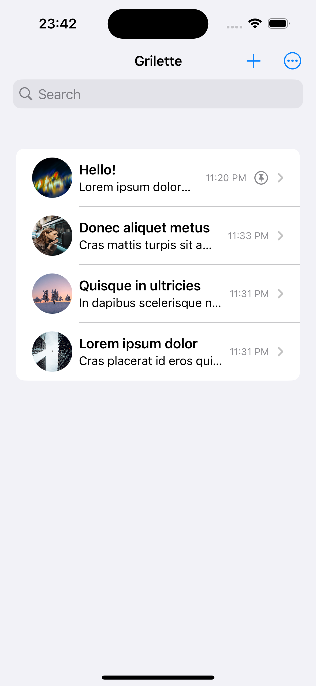

# Grilette

| View One    | View Two    | View Three  |
| :---------: | :---------: | :---------: |
|  |  |  |

## Introduction
Your go-to app for managing daily notes, creative ideas, and to-do lists with ease. It's packed with features like search capabilities, image attachment options and dark mode support making "Grilette" note management.

## Features of Grilette
### Adding and Editing Notes
- Create detailed notes with dedicated title and content sections.
- Freedom to edit your notes anytime, ensuring they always stay up-to-date.

### Advanced Search
- Quickly find what you're looking for with fast and effective search in titles and contents.
- Case-insensitive search means you won't miss a thing.

### Pinning Notes
- Pin your most important notes for swift access.

### Date and Time Information
- Track creation and last edited dates for each note.

### Adding Images
- Enrich your notes with images, adding a visual dimension to your thoughts.

### Dark Mode Support
- Switch to dark mode to reduce eye strain and personalize your user experience.
